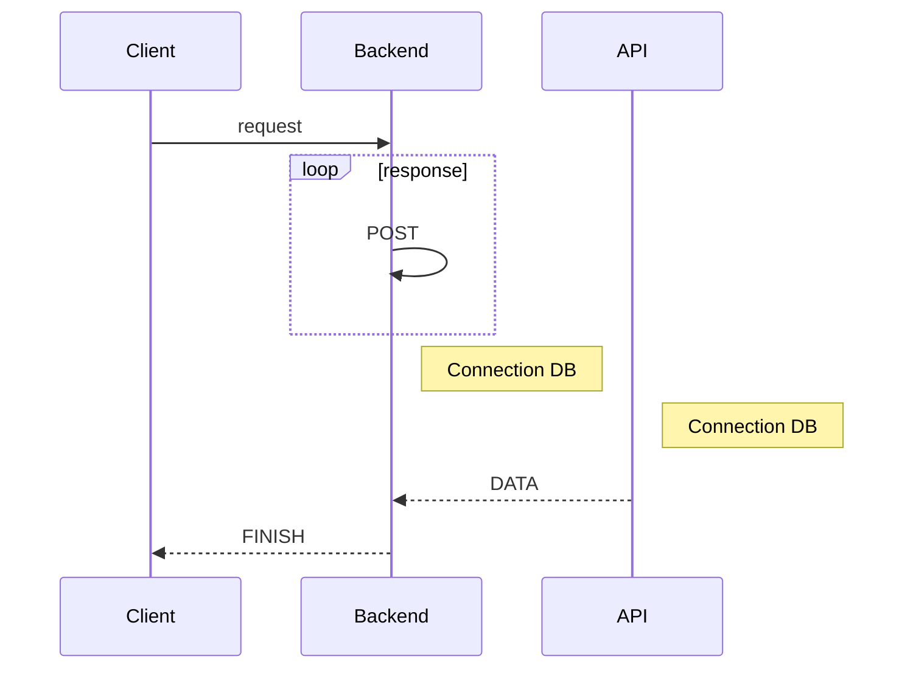
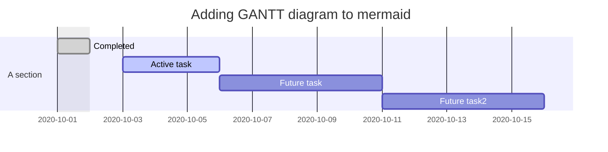
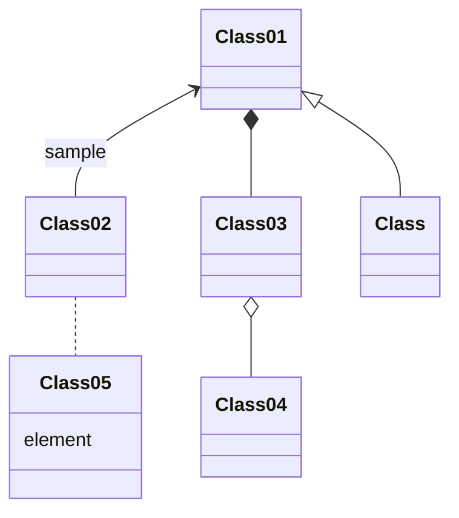

# mermaid sample code

## Flowchart

```mermaid
graph TD;
    A-->B-->D;
    A-->C-->D;
```

## Sequence Diagram

```mermaid
sequenceDiagram
    participant Client
    participant Backend
    participant API
    # comment
    Client->>Backend:request
    # loop describe
    loop response
        Backend->>Backend:POST
    end
    # Note positoin of NAME
    Note left of API:Connection DB
    Note right of API:Connection DB
    # --> 点線
    API-->>Backend:DATA
    Backend-->>Client:FINISH
```

## Gantt Diagram

```mermaid
gantt
dateFormat YYYY-MM-DD
title Adding GANTT diagram to mermaid
excludes weekdays 2020-10-01

section A section
Completed:done,des1, 2020-10-01,2020-10-02
Active task:active,  des2, 2020-10-03, 3d
Future task:des3, after des2, 5d
Future task2:des4, after des3, 5d
```

## Class Diagram

```mermaid
classDiagram
Class01<--Class02:sample
Class01 *-- Class03
Class03 o-- Class04
Class02 .. Class05
Class01 <|-- Class
Class05: element
```
